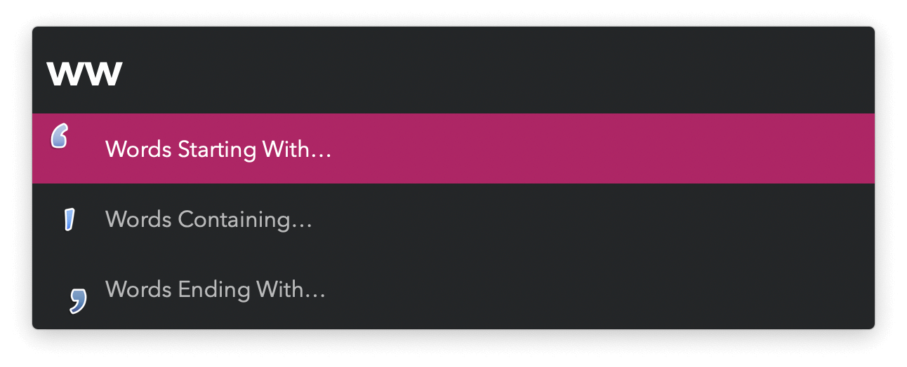
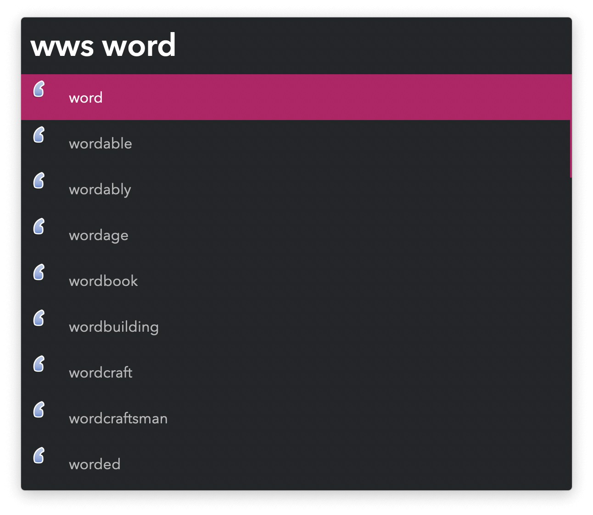

#  Words With Alfred Workflow

Find words that contain a particular pattern

[⤓ Install on the Alfred Gallery](https://alfred.app/workflows/vitor/words-with)

## Usage

Search for words starting with a specific combination of letters via the `wws` keyword. `wwa` searches for words with the string anywhere and the `wwe` keyword lists words ending in the pattern. <kbd>↩&#xFE0E;</kbd> shows the word’s definition in Alfred.

